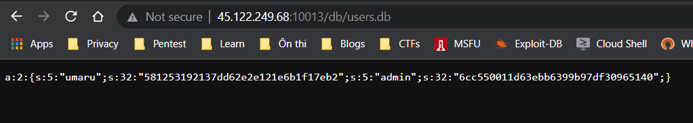

# Umaru loves PHP (Web)

Đầu tiên mình sử dụng gobuster để scan

<figure><figcaption></figcaption></figure>

Kiểm tra robots.txt

<figure><figcaption></figcaption></figure>

Vào check /?source ta có được source code của web


```php
<?php
ini_set('display_errors', 0);
error_reporting(0);

include 'flag.php';

// Sinh ngẫu nhiên $len bytes
function urandom($len) {
    return file_get_contents('/dev/urandom', length: $len);
}

// Khởi tạo users và lưu vào database;
if (!is_file('db/users.db')) {
    $users = array(
        'umaru' => md5('umaru_hates_php'),
        'admin' => md5('admin.' . md5(urandom(3))),
    );
    file_put_contents('db/users.db', serialize($users));
}

// Login check
if (isset($_POST['username']) && isset($_POST['password'])) {
    $users = unserialize(file_get_contents('db/users.db'));

    $username = $_POST['username'];
    $password = $_POST['password'];

    if ($users[$username] == md5($password)) {
        if ($username == 'admin') {
            $message = 'Here is your flag: ' . $flag;
        }
        else {
            $message = 'Hello ' . $username;
        }
    }
    else {
        $message = 'Wrong username or password!';
    }
}

if (isset($_GET['source'])) {
    highlight_file(__FILE__);
}
?>
<!DOCTYPE html>
<html>
<head>
   <title>Login</title>
   <link href="static/bootstrap.min.css" rel="stylesheet">
</head>
<body>
    <div class="container" style="margin-top: 100px">  
        <form action="/index.php" method="POST" class="well" style="width: 240px; margin: 0px auto;"> 
            
            <h3>Login</h3>
            <label>Username:</label>
            <input type="text" name="username" style="height: 30px" class="span3"/>
            <label>Password:</label>
            <input type="password" name="password" style="height: 30px" class="span3">
            <button type="submit" style="margin: 15px auto;" class="btn btn-primary">LOGIN</button>
            <?php if (isset($message)) { echo '<h5>' . $message .'</h5>'; } ?>
        </form>
    </div>
</body>
</html>
```


Để ý đến cách tạo user và database

```php
function urandom($len) {
    return file_get_contents('/dev/urandom', length: $len);
}

// Khởi tạo users và lưu vào database;
if (!is_file('db/users.db')) {
    $users = array(
        'umaru' => md5('umaru_hates_php'),
        'admin' => md5('admin.' . md5(urandom(3))),
    );
    file_put_contents('db/users.db', serialize($users));
}
```

Bài này xài hàm `urandom` và `md5` để khởi tạo hash cho admin mà lưu database vào db/users.db

Mình kiểm tra thì file users.db có thể truy cập được

<figure><figcaption></figcaption></figure>

Mình lưu database và source code về để debug local

Mình thêm code vào để in hash md5 của `admin` ra và chạy while loop đến khi nào generate password có hash md5 đúng bằng của `admin`

```php
    echo $users["admin"];
    echo "\r\n";
    echo md5($password);
    echo "\r\n\r\n";
    while(true){
    	$x='admin.' . md5(urandom(3));
    	if(md5($x) == $users["admin"]){
    		echo "here: ";
    		echo $x;
    		break;
    	}
    }
```



Sau hồi một hồi đợi lâu thì cũng ra được password.

<figure><figcaption></figcaption></figure>

Kiểm tra trên server

<figure><figcaption></figcaption></figure>

Flag: `W1{brutef0rce_is_s0_gud}`

P/s: mình thêm `ini_set('max_execution_time', '300');` để tăng thời gian timeout cho bruteforce.
